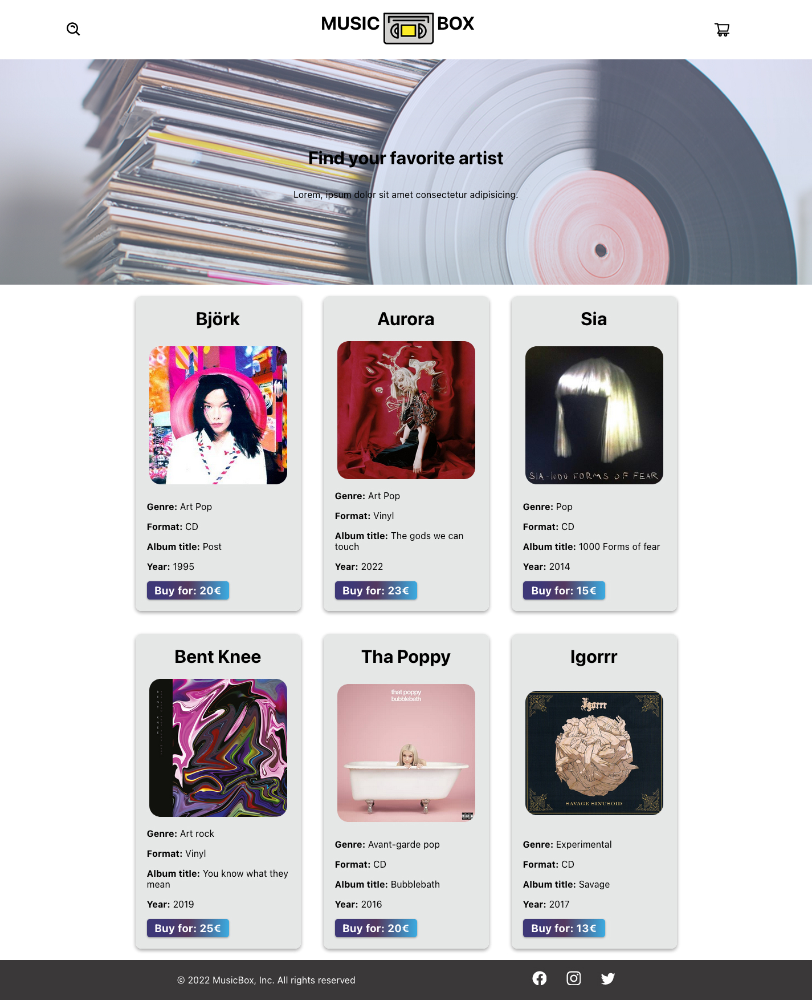

# Music Box FrontEnd 📻

This project is part of a hackathon that took place on february 16 and 17 \
We have to create a marketplace with the minimum viable product:

- A home page with a list of all ads
- A show page that shows more information about the ad

In this repository we create the User Interface for our Music Box marketplace \
[You can access the back of Music Box here](https://github.com/SolTuripe/musicbox-backend)

## Project Setup 📌

This project was bootstrapped with [Create React App](https://github.com/facebook/create-react-app).

We use React, a Javascript library that can build user interface components.
These componentes are reusable bits of code made with JavaScript and HTML.
CSS is included to make the style of the web.

The project also has the following dependecies:

    "@testing-library/jest-dom": "^5.16.2",
    "@testing-library/react": "^12.1.3",
    "@testing-library/user-event": "^13.5.0",
    "axios": "^0.26.0",
    "react": "^17.0.2",
    "react-dom": "^17.0.2",
    "react-icons": "^4.3.1",
    "react-router-dom": "^6.2.1",
    "react-scripts": "5.0.0",
    "web-vitals": "^2.1.4"

- You can clone the repository here: https://github.com/zizi21v/MusicBox_Frontend

## Getting Started with Create React App

- First step npm install
- Second step cd musicbox-frontend

## Page View

## Available Scripts

In the project directory, you can run:

### `npm start`

Runs the app in the development mode.\
Open [http://localhost:3000](http://localhost:3000) to view it in your browser.

The page will reload when you make changes.\
You may also see any lint errors in the console.

### `npm test`

Launches the test runner in the interactive watch mode.\
See the section about [running tests](https://facebook.github.io/create-react-app/docs/running-tests) for more information.

## For future versions

### `npm run build`

Builds the app for production to the `build` folder.\
It correctly bundles React in production mode and optimizes the build for the best performance.

The build is minified and the filenames include the hashes.\
Your app is ready to be deployed!

See the section about [deployment](https://facebook.github.io/create-react-app/docs/deployment) for more information.

### `npm run eject`

**Note: this is a one-way operation. Once you `eject`, you can't go back!**

If you aren't satisfied with the build tool and configuration choices, you can `eject` at any time. This command will remove the single build dependency from your project.

Instead, it will copy all the configuration files and the transitive dependencies (webpack, Babel, ESLint, etc) right into your project so you have full control over them. All of the commands except `eject` will still work, but they will point to the copied scripts so you can tweak them. At this point you're on your own.

You don't have to ever use `eject`. The curated feature set is suitable for small and middle deployments, and you shouldn't feel obligated to use this feature. However we understand that this tool wouldn't be useful if you couldn't customize it when you are ready for it.

## Learn More

You can learn more in the [Create React App documentation](https://facebook.github.io/create-react-app/docs/getting-started).

To learn React, check out the [React documentation](https://reactjs.org/).

## Authors 👩‍💻

- [Sol Turipe](https://github.com/SolTuripe)
- [Laura Farrer](https://github.com/laurasoad)
- [Sandra Barrachina](https://github.com/Sbarrachina)
- [Dargy Mogollón](https://github.com/DargyJML)
- [Erika Prieto](https://github.com/Eriry930)
- [Christian Bazan](https://github.com/Infestas36)
- [Valeria Ziegler](https://github.com/zizi21v)

## Gratitude 🎁

Tell others about this project 📢 \
Support our projects ⭐ \
Thank you very much to all the organizations that made this hackathon possible, especially to Factoría F5 and Adevinta Spain 💜
